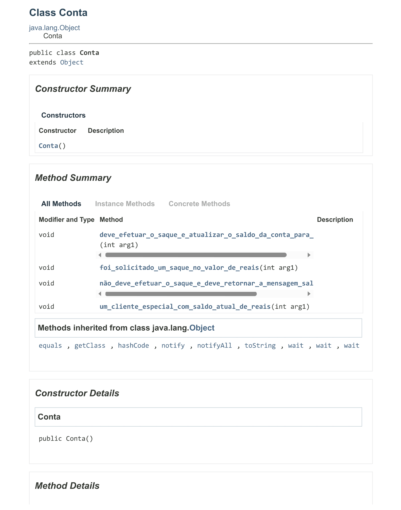

<h1 align="center"><strong>Conta Bancária (BDD)</strong></h1>

## Sobre

Atividade de Qualidade e Testes de Software, na qual devemos aplicar o modelo de `Behavior-Driven Development` em uma classe de uma conta bancária, desenvolvida na linguagem Java utilizando o software Eclipse.

## BDD (Behavior-Driven Development)

A abordagem BDD, tem como objetivo descrever todas as funcionalidades das técnicas presentes dentro de um software, através de uma simulação de comportamento.

## Ambiente de Testes e seus Cenários

Para aplicar a abordagem BDD com êxito, foi necessário utlizar um biblioteca chamada Cucumber, na qual possibilita efetuar testes através de `tags`, essas `tags` consistem basicamente na criação de rotólus associados a `features` ou cenários.

No arquivo `arquivo_teste.feature`, foram criados os seguintes cenários, para realização de teste e inserção de informações referente ao projeto:

## Classe Conta

Dentro dos arquivos postados, temos a classe `Conta`, na qual, com o auxílio do Cucumber, irá fazer relatar diversas informações que devem conter na documentação. A seguir vemos o `javadoc` da classe:

## Resultado

Para que seja possível rodar a aplicação, foi utilizada a classe `Runner`, na qual foi utilizada a dependência `Cucumber JVM: Java`, responsável por tornar possível executar e testar a aplicação através da classe.

Por fim, o resultado que o `Cucumber` irá exibir, será:

## Última atualização: 01/12/2023
